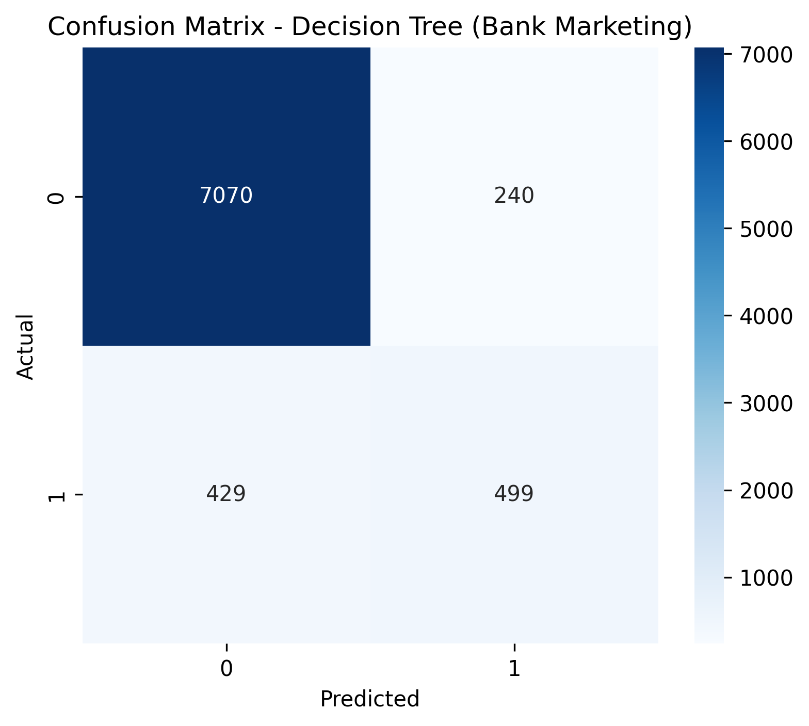

# PRODIGY_DS_03 — Decision Tree Classification (Bank Marketing)

This project trains and evaluates a **Decision Tree Classifier** on the UCI Bank Marketing dataset to predict whether a client will subscribe to a term deposit (`y`).

## Workflow
- Data loading and validation
- Preprocessing with `ColumnTransformer`:
  - Missing value imputation
  - One-hot encoding for categorical features
- Model training (Decision Tree)
- Evaluation with accuracy, classification report, and confusion matrix
- Feature importance analysis
- Model export for reuse

## Results
### Confusion Matrix


### Feature Importance (Top 15)


## How to Run
```bash
pip install -r requirements.txt


---

## Step 10 — Git push to Task-03 repo

In terminal (inside `PRODIGY_DS_03`):

```bash
git add .
git commit -m "Task 03: Decision Tree classifier with evaluation, feature importance, and saved model"
git push